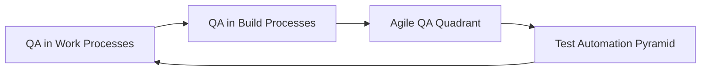
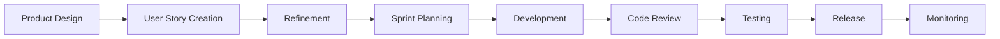
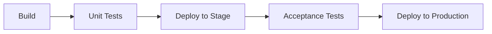

# QA Framework

## QA Rammeverk / QA Framework
Template

---

# QA in Four Dimensions

## Overview

To ensure a **shift-left approach**, QA must be integrated across:

- **QA in work processes**
  - Focus on early defect detection and prevention
  - Examples: User stories, Gherkin syntax, DoR, DoD

- **QA in build processes**
  - Define which tests run in pipelines and when
  - QA should influence pipeline design

- **Agile QA Quadrant**
  - Classifies tests by:
    - Business vs Technology focus
    - Supporting development vs Critiquing product

- **Test Automation Pyramid**
  - Guides test distribution and frequency

### Key Principles

- QA is broader than testing
- Integrated early in SDLC
- Shared responsibility across the team
- QA owns the process, but quality is teamwork

---

## Four Dimensions (Diagram)



---

# Fokus på QA i fire dimensjoner (Norwegian)

## QA i arbeidsprosesser
- Fokus på:
  - User story kvalitet
  - Code review
  - Buddy testing
  - DoR / DoD

## QA i byggeprosesser
- Hvilke tester kjøres i pipeline?
- QA bør bidra til beslutninger

## Smidig QA kvadrant
- Visualiserer testtyper og ansvar

## Testpyramiden
- Visualiserer forholdet mellom testnivåer

---

# QA i arbeidsprosessen – eksempel

## Flow (Simplified)



## Key Practices

- **DoR (Definition of Ready)**
  - Clear acceptance criteria
  - INVEST principles
  - Design artifacts (e.g. Figma)

- **Development Quality Measures**
  - Unit testing
  - Code review
  - Pair programming
  - Buddy testing

- **Testing Levels**
  - Team testing
  - SME testing
  - UX validation

---

# QA in Build Processes

## Pipeline Overview



## Concepts

- Continuous Integration
- Continuous Delivery
- Continuous Deployment

QA responsibilities:
- Define test stages
- Ensure test coverage
- Suggest pipeline improvements

---

# Agile QA Quadrant

## Diagram

```mermaid
quadrantChart
    title Agile QA Quadrant
    x-axis Supporting Development --> Critique Product
    y-axis Technology Facing --> Business Facing

    quadrant-1 Q1: Unit & Component Tests
    quadrant-2 Q2: Functional / Story Tests
    quadrant-3 Q3: Exploratory / UAT
    quadrant-4 Q4: Performance / Security

    Q1: [0.2, 0.2]
    Q2: [0.2, 0.8]
    Q3: [0.8, 0.8]
    Q4: [0.8, 0.2]
```

## Explanation

- **Q1**
  - Tech-focused, supports dev
  - Unit & integration tests
  - Mostly automated

- **Q2**
  - Business-facing, supports dev
  - Functional tests
  - Manual + automated

- **Q3**
  - Business-facing, critiques product
  - Exploratory & usability testing
  - Manual test suites and test management tools (e.g. Azure Test Plans, TestRail, Zephyr Scale, Xray)
  - Mostly manual

- **Q4**
  - Tech-focused, critiques product
  - Performance & security tests
  - Automated

---

# Test Automation Pyramid

## Diagram

```mermaid
pyramid
    title Test Automation Pyramid
    "E2E Tests" : 1
    "API Tests" : 3
    "Unit Tests" : 6
```

## Key Insights

- More tests at lower levels (unit)
- Fewer at higher levels (E2E)

### Trade-offs (as you go up):

- ↑ Cost
- ↑ Execution time
- ↑ False negatives risk

But also:

- ↑ Coverage
- ↑ Business relevance

---

## Guidelines

- Automate across all levels
- Adjust based on:
  - Complexity
  - Risk
  - Tech stack
- Developers should own unit tests
- QA helps define automation strategy

---

# Summary

- QA is **process-focused**, not just testing
- Requires **early involvement**
- Built on **four dimensions**:
  1. Work processes
  2. Build processes
  3. QA quadrant
  4. Test pyramid
- Ensures:
  - Better quality
  - Clear responsibilities
  - Continuous improvement
