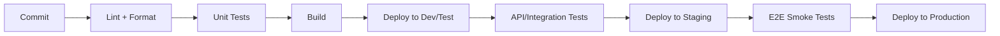

# QA Foundation Strategy — [Project Name]

> **Purpose:** This document prescribes QA practices for a newly established team or greenfield project. Rather than diagnosing gaps in an existing system, it defines what to build from day one and in what sequence.

**Project:** [Project name and short description]
**Version:** [X.Y]
**Last updated:** [YYYY-MM-DD]
**Author:** [QA consultant name]
**Status:** Draft — to be reviewed and refined collaboratively with the team

> **Versioning rules (managed automatically on regeneration):**
> - `Last updated` = today's date in `YYYY-MM-DD` format.
> - `Version` follows `MAJOR.MINOR`:
>   - First generation = `1.0`.
>   - Increment **MINOR** for refinements or additions.
>   - Increment **MAJOR** when team context, tech stack, or strategy direction changes materially.
> - Add a row to the **Version History** table below for every regeneration.

### Version History

| Version | Date | Author | Summary of changes |
|---|---|---|---|
| [X.Y] | [YYYY-MM-DD] | [Author] | [What changed] |

**Sources used:**
- [List sources: team interviews, architecture decisions, tech stack choices, customer requirements, etc.]

**Assumptions to validate:**
- [List key assumptions that haven't been confirmed yet]

---

## 1. Executive Summary

### Project Context

[Describe the project: what it will do, who the users are, chosen tech stack, deployment model, team composition, delivery model, and timeline. Include the planned git branching strategy.]

### Key Constraints

- [Constraint 1 — e.g. compliance requirements, customer approval processes]
- [Constraint 2 — e.g. team experience level, budget limits]
- [Constraint 3 — e.g. integration dependencies, legacy system interfaces]

### Top Quality Risks for a New Project

1. [Risk 1 — e.g. QA practices not established before velocity ramps up]
2. [Risk 2 — e.g. no test infrastructure means defects discovered late]
3. [Risk 3 — e.g. team norms around quality not yet formed]
4. [Risk 4 — e.g. requirements unclear, acceptance criteria missing]
5. [Risk 5 — e.g. no monitoring or alerting in place at launch]

### QA Foundation Goals

What the team should achieve in each phase:

| Phase | Timeline | QA Goal |
|---|---|---|
| Sprint 0 | [Week 1–2] | [e.g. CI pipeline with linting + unit test stage, board with DoR/DoD, issue templates] |
| First Month | [Week 3–6] | [e.g. test pyramid base layer in place, code review norms, first API tests] |
| First Quarter | [Month 2–3] | [e.g. E2E smoke tests, security scanning, monitoring, stable test data] |
| Steady State | [Month 4+] | [e.g. full quadrant coverage, metrics-driven improvement, exploratory testing cadence] |

### Priority Recommendations (Top 5)

1. [Recommendation 1]
2. [Recommendation 2]
3. [Recommendation 3]
4. [Recommendation 4]
5. [Recommendation 5]

---

## 2. Delivery Flow — Recommended Design

### 2.1 Recommended Board Structure

[Prescribe a board structure appropriate for the team's delivery model. Define columns, their purpose, and flow rules.]

| Column | Purpose | Entry Criteria (DoR) | Exit Criteria (DoD) |
|---|---|---|---|
| **Backlog** | Prioritized work not yet refined | — | — |
| **Refinement** | Stories being elaborated | Has title and rough scope | Acceptance criteria written, estimated, technically clarified |
| **Ready** | Fully refined, ready for sprint | Meets full DoR (see below) | — |
| **In Progress** | Active development | Developer assigned | — |
| **In Review** | Code review + QA | PR created, tests passing | Code review approved, functional test passed |
| **Done** | Deployed and verified | — | Deployed to [env], PO accepted, monitoring confirmed |

### 2.2 Definition of Ready (DoR) — Recommended

Criteria a work item must meet before development starts:

- [ ] Clear description of what and why
- [ ] Acceptance criteria defined (Given/When/Then or checklist)
- [ ] UX/design attached (if applicable)
- [ ] Story points estimated
- [ ] Technical approach clarified (dependencies, risks identified)
- [ ] Test approach noted (what level of testing is needed)

### 2.3 Definition of Done (DoD) — Recommended

Criteria a work item must meet to be considered complete:

- [ ] Code written and unit tests passing
- [ ] Code review approved (min 1 reviewer)
- [ ] Deployed to test/staging environment
- [ ] Functional testing passed (manual or automated)
- [ ] No known regressions introduced
- [ ] Documentation updated (if applicable)
- [ ] PO/stakeholder acceptance (if required)
- [ ] Monitoring/logging verified in target environment

### 2.4 Issue Templates — Recommended

Define these from the start:

- **Bug report** — reproduction steps, expected vs actual, severity, environment
- **Feature/Story** — description, acceptance criteria, design link, dependencies
- **Spike** — question to answer, timebox, output format

---

## 3. QA in Work Processes — Foundation Plan

### What to Implement

[Prescribe the QA practices to embed in the team's work processes from the start. Tailor to the team's delivery model.]

**Sprint 0 / Immediate:**
- [Practice 1 — e.g. establish DoR/DoD as working agreements]
- [Practice 2 — e.g. QA participates in refinement from day one]
- [Practice 3 — e.g. define bug handling workflow]

**First Month:**
- [Practice 4 — e.g. buddy testing for all features before merge]
- [Practice 5 — e.g. retrospective includes quality metrics review]
- [Practice 6 — e.g. acceptance criteria review before sprint planning]

**First Quarter:**
- [Practice 7 — e.g. exploratory testing sessions (timeboxed)]
- [Practice 8 — e.g. cross-team QA knowledge sharing]
- [Practice 9 — e.g. customer demo/UAT cadence established]

### Role Expectations

| Role | QA Responsibility |
|---|---|
| **QA** | Owns QA process, facilitates test strategy, reviews acceptance criteria, performs exploratory testing |
| **Developer** | Writes unit/integration tests, participates in code review, follows DoD |
| **PO/Designer** | Ensures acceptance criteria quality, participates in UAT, prioritizes bugs |
| **Tech Lead** | Champions technical quality, reviews test architecture decisions |

### AI

- **Opportunity:** [Where AI can help from the start — e.g. generating test cases from acceptance criteria, code review assistance, test data generation]
- **Guardrails:** [What to be careful about — e.g. AI-generated tests still need review, don't rely on AI for security testing]

---

## 4. QA in Build Processes — Foundation Plan

### Pipeline Design — Recommended

[Prescribe the CI/CD pipeline stages and quality gates to implement.]



**Sprint 0 / Immediate:**
- [ ] CI pipeline runs on every PR
- [ ] Linting and formatting enforced (fail on violation)
- [ ] Unit test stage (even if starting with 0 tests — the stage exists)
- [ ] Build verification (compile/bundle succeeds)
- [ ] Branch protection: require PR, require CI pass, require 1 reviewer

**First Month:**
- [ ] Test coverage reporting (track trend, don't gate on arbitrary %)
- [ ] Dependency vulnerability scanning (e.g. Dependabot, Snyk)
- [ ] Staging environment with automated deployment
- [ ] API test stage added to pipeline

**First Quarter:**
- [ ] E2E smoke test suite in pipeline
- [ ] Security scanning (SAST, secret detection)
- [ ] Performance baseline tests (if applicable)
- [ ] Feature flag infrastructure (if progressive delivery is planned)

### Code Review Conventions — Recommended

- All changes via PR (no direct push to main/trunk)
- Minimum 1 reviewer, prefer 2 for critical paths
- PR template with checklist (tests added? docs updated? breaking changes?)
- Review within [X hours] SLA to avoid blocking

### Environment Strategy — Recommended

| Environment | Purpose | Deploy Trigger | Test Level |
|---|---|---|---|
| **Dev/Local** | Developer testing | Manual / on commit | Unit, component |
| **Test/Integration** | Team testing, API tests | On PR merge | Integration, API |
| **Staging** | Pre-production verification | On release candidate | E2E, UAT |
| **Production** | Live users | Manual approval / automated | Smoke, monitoring |

### AI

- **Opportunity:** [e.g. AI-assisted code review, automated test generation in pipeline, intelligent flaky test detection]

---

## 5. Agile QA Quadrant — Target State

### Target by Phase

| Quadrant | Sprint 0 | First Month | First Quarter | Steady State |
|---|---|---|---|---|
| **Q1 — Tech-facing, supports dev** (unit, integration) | Set up test framework, first tests | Cover critical paths | Good coverage of core logic | Comprehensive, fast feedback |
| **Q2 — Business-facing, supports dev** (functional, story tests) | Acceptance criteria defined | Buddy testing on all stories | Automated acceptance tests for key flows | Full story test coverage |
| **Q3 — Business-facing, critiques product** (exploratory, UAT) | — | Ad-hoc exploratory | Scheduled exploratory sessions | Regular cadence + UAT process |
| **Q4 — Tech-facing, critiques product** (perf, security) | Dependency scanning | — | Security scan in pipeline, baseline perf | Regular perf/security audits |

### Tooling Recommendations

| Quadrant | Recommended Tools | Notes |
|---|---|---|
| Q1 | [e.g. xUnit/.NET, Jest/React, pytest] | Match the tech stack |
| Q2 | [e.g. Playwright, Cypress, Postman/Newman] | Start with API, add UI later |
| Q3 | [e.g. structured exploratory charters, bug bash sessions] | Low tooling cost, high insight |
| Q4 | [e.g. OWASP ZAP, k6, Lighthouse] | Automate where possible |

### AI

- [Where AI can accelerate test creation across quadrants]

---

## 6. Test Pyramid — Target Architecture

### Recommended Distribution

```
        /\
       /  \        E2E (few)
      /    \       — Critical user journeys only
     /------\
    /        \     API / Integration (moderate)
   /          \    — Service boundaries, contracts
  /------------\
 /              \  Unit (many)
/                \ — Business logic, utilities, validators
```

### Target by Phase

| Level | Sprint 0 | First Month | First Quarter | Tooling |
|---|---|---|---|---|
| **Unit** | Framework set up, first tests written | Critical logic covered | [Target coverage %] | [Tool] |
| **API/Integration** | — | First contract tests | Key endpoints covered | [Tool] |
| **E2E** | — | — | Smoke test for critical path | [Tool] |

### Principles

- **Start at the bottom.** Unit tests are cheapest, fastest, and most stable. Build the base first.
- **Don't skip the middle.** API/integration tests catch contract breaks that unit tests miss. Add them before E2E.
- **E2E is the roof, not the foundation.** Only automate critical user journeys end-to-end. Keep the suite small and fast.
- **Every new feature gets tests at the appropriate level.** Make this part of DoD from day one.

### Authentication / Environment Considerations

[Note planned approach to test authentication, test data, and environment isolation. Address these early to avoid them becoming blockers later.]

### AI

- [Where AI can help — e.g. generating unit test scaffolds, suggesting test cases from code changes]

---

## 7. Foundation Checklist

### Sprint 0 — Must Have Before First Sprint

| # | Action | Owner | Status |
|---|---|---|---|
| F1 | [e.g. Set up CI pipeline with lint + build + test stages] | [Role] | ☐ |
| F2 | [e.g. Configure branch protection on main] | [Role] | ☐ |
| F3 | [e.g. Create board with columns and DoR/DoD] | [Role] | ☐ |
| F4 | [e.g. Create issue templates (bug, feature, spike)] | [Role] | ☐ |
| F5 | [e.g. Set up test framework and write first test] | [Role] | ☐ |
| F6 | [e.g. Agree on code review conventions] | [Role] | ☐ |
| F7 | [e.g. Define working agreements (DoR, DoD, review SLA)] | [Role] | ☐ |

### First Month — Build the Base

| # | Action | Owner | Status |
|---|---|---|---|
| M1 | [e.g. Achieve unit test coverage on critical business logic] | [Role] | ☐ |
| M2 | [e.g. Add API test stage to pipeline] | [Role] | ☐ |
| M3 | [e.g. Set up staging environment with automated deploy] | [Role] | ☐ |
| M4 | [e.g. Implement dependency vulnerability scanning] | [Role] | ☐ |
| M5 | [e.g. Establish buddy testing practice] | [Role] | ☐ |
| M6 | [e.g. First retrospective with quality metrics] | [Role] | ☐ |

### First Quarter — Mature the Practice

| # | Action | Owner | Status |
|---|---|---|---|
| Q1 | [e.g. E2E smoke test suite running in pipeline] | [Role] | ☐ |
| Q2 | [e.g. Security scanning (SAST + dependency) automated] | [Role] | ☐ |
| Q3 | [e.g. Exploratory testing cadence established] | [Role] | ☐ |
| Q4 | [e.g. Monitoring and alerting in production] | [Role] | ☐ |
| Q5 | [e.g. Test data strategy defined and implemented] | [Role] | ☐ |
| Q6 | [e.g. Performance baseline established] | [Role] | ☐ |

---

## 8. Presentation Summary

### What We're Building

[2–3 sentences: the QA foundation we're establishing and why it matters for this project specifically.]

### Why Start with QA Infrastructure

- [Value 1 — e.g. defects found in sprint cost 10x less than defects found in production]
- [Value 2 — e.g. CI quality gates prevent regression from day one]
- [Value 3 — e.g. clear DoR/DoD reduces rework and scope creep]
- [Value 4 — e.g. team norms around quality established early are self-reinforcing]

### Investment vs. Payoff

| Investment (Sprint 0) | Payoff (Ongoing) |
|---|---|
| [e.g. 2–3 days pipeline setup] | [e.g. automated feedback on every PR, no manual gate-keeping] |
| [e.g. 1 day DoR/DoD workshop] | [e.g. fewer incomplete stories entering development] |
| [e.g. 1 day test framework setup] | [e.g. regression safety net grows with every feature] |

### Collaborative Next Step

[Describe how to present this to the team and invite them to co-own the foundation checklist. Frame it as "we're building this together" not "QA mandates this."]

---

## 9. Maturity Roadmap

### Growth Model

| Maturity Level | Characteristics | Target Timeline |
|---|---|---|
| **Level 0 — Ad hoc** | No consistent practices, quality is accidental | Starting point |
| **Level 1 — Foundation** | Basic pipeline, DoR/DoD in place, some tests exist | End of Sprint 0 |
| **Level 2 — Repeatable** | Tests at multiple levels, code review enforced, quality visible | End of Month 1 |
| **Level 3 — Defined** | Full pyramid, security scanning, monitoring, exploratory cadence | End of Quarter 1 |
| **Level 4 — Measured** | Metrics-driven decisions, continuous improvement, predictable quality | 6+ months |

### Metrics to Track from the Start

| Metric | When to Start Measuring | Initial Target |
|---|---|---|
| CI pass rate | Sprint 0 | > 90% |
| Unit test coverage (critical paths) | First Month | [Target %] |
| PR review turnaround time | Sprint 0 | < [X] hours |
| Escaped defects (bugs found post-deploy) | First Quarter | Trending down |
| Lead time (ready → done) | First Month | Baseline established |
| Deployment frequency | First Month | [Target cadence] |

### Review Cadence

- **Weekly:** Quick check — are the Sprint 0 / Month 1 actions progressing?
- **Per sprint:** Retrospective includes quality dimension — what broke, what caught it, what's missing?
- **Monthly:** Review metrics trends, adjust priorities, update this strategy.
- **Quarterly:** Full strategy review — are we on track for the maturity roadmap?

### Action Tracking

- [How actions will be tracked — recommend as work items on the team board]
- [Label/tag convention for QA foundation items]
- [Who reviews progress and when]

---

## 10. Open Questions

Questions that need answers to finalize this strategy:

### Technical Decisions

- [e.g. Has the team decided on a test framework?]
- [e.g. What authentication approach will be used, and how will tests handle it?]

### Process Decisions

- [e.g. What's the planned sprint length / iteration cadence?]
- [e.g. Who will own the staging environment?]

### Stakeholder Alignment

- [e.g. Does the customer require formal UAT before production releases?]
- [e.g. Are there compliance requirements that affect test evidence?]
