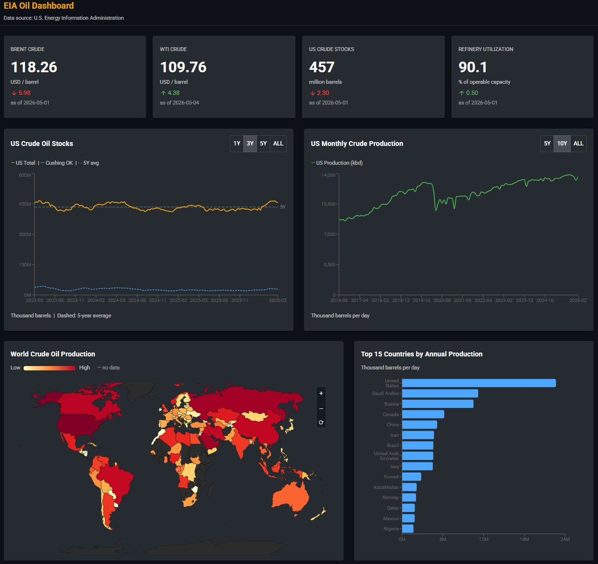

# EIA Oil Dashboard

A clean, locally-runnable dashboard of US and global oil market indicators,
sourced entirely from the [U.S. Energy Information Administration (EIA)
open data API v2](https://www.eia.gov/opendata/).

- **Backend**: Python + FastAPI + DuckDB (file-based, no server)
- **Frontend**: React 18 + Vite + Material UI dark theme
- **Data layout**: bronze (raw) → silver (cleaned) → gold (dashboard views) in DuckDB



## Panels

1. **KPI cards** — Brent, WTI, US commercial crude stocks, refinery utilization (with daily/weekly change)
2. **US crude oil stocks** — weekly time series with US total + Cushing OK + a true 5-year weekly seasonal average
3. **US monthly crude production** — monthly time series, 5Y / 10Y / All toggles
4. **Top 15 producing countries** — latest annual horizontal bar chart, US highlighted
5. **World choropleth map** — `geoNaturalEarth1` projection with a log colour scale (yellow → red)

## Prerequisites

- **Python 3.11+**
- **Node.js 22.x LTS** (Node 22.12 or newer; or Node 20.19+)
- **EIA API key** — register for a free key at https://www.eia.gov/opendata/
- **uv** for Python package management. If you don't have it:
  ```sh
  pip install uv
  ```

## Setup

```sh
# 1. Clone and configure secrets
git clone <this-repo>
cd eia-oil-dashboard
cp .env.example .env
# edit .env and paste your EIA_API_KEY

# 2. Backend — create venv and install dependencies
cd backend
uv sync

# 3. First-time data load (downloads several thousand rows from EIA; takes a few minutes)
uv run python ingestion/run_ingestion.py

# 4. Start the FastAPI server
uv run uvicorn main:app --reload
# -> http://localhost:8000
```

In a second terminal:

```sh
# 5. Frontend
cd frontend
npm install
npm run dev
# -> http://localhost:5173
```

## Refreshing data

The ingestion script is the only thing that talks to the EIA API. Re-run it
whenever you want fresh data:

```sh
cd backend
uv run python ingestion/run_ingestion.py
```

It does a full replace of every bronze/silver table on each run, so the
operation is idempotent.

## Custom backend port

If something else is already on port 8000, uvicorn will pick a different one.
Tell the frontend by creating `frontend/.env.local`:

```
VITE_API_URL=http://localhost:8001
```

## Project layout

```
eia-oil-dashboard/
├── backend/
│   ├── main.py                  # FastAPI app
│   ├── db.py                    # Shared DuckDB connection
│   ├── ingestion/
│   │   ├── fetch_eia.py         # Verified EIA API client (do not modify)
│   │   └── run_ingestion.py     # Bronze → silver → gold pipeline
│   └── pyproject.toml           # uv-managed dependencies
├── frontend/
│   ├── src/
│   │   ├── App.jsx
│   │   ├── api/client.js        # axios instance pointing at FastAPI
│   │   ├── hooks/useFetch.js    # Per-panel fetch hook (no global Promise.all)
│   │   └── components/          # KpiCards, CrudeStocksChart, ProductionChart, ...
│   └── package.json
├── data/
│   └── oil_dashboard.duckdb     # local DB file (gitignored, created by ingestion)
└── .env.example
```

## Data source credit

All series come from the **U.S. Energy Information Administration** open
data API v2. See https://www.eia.gov/opendata/ for terms.
